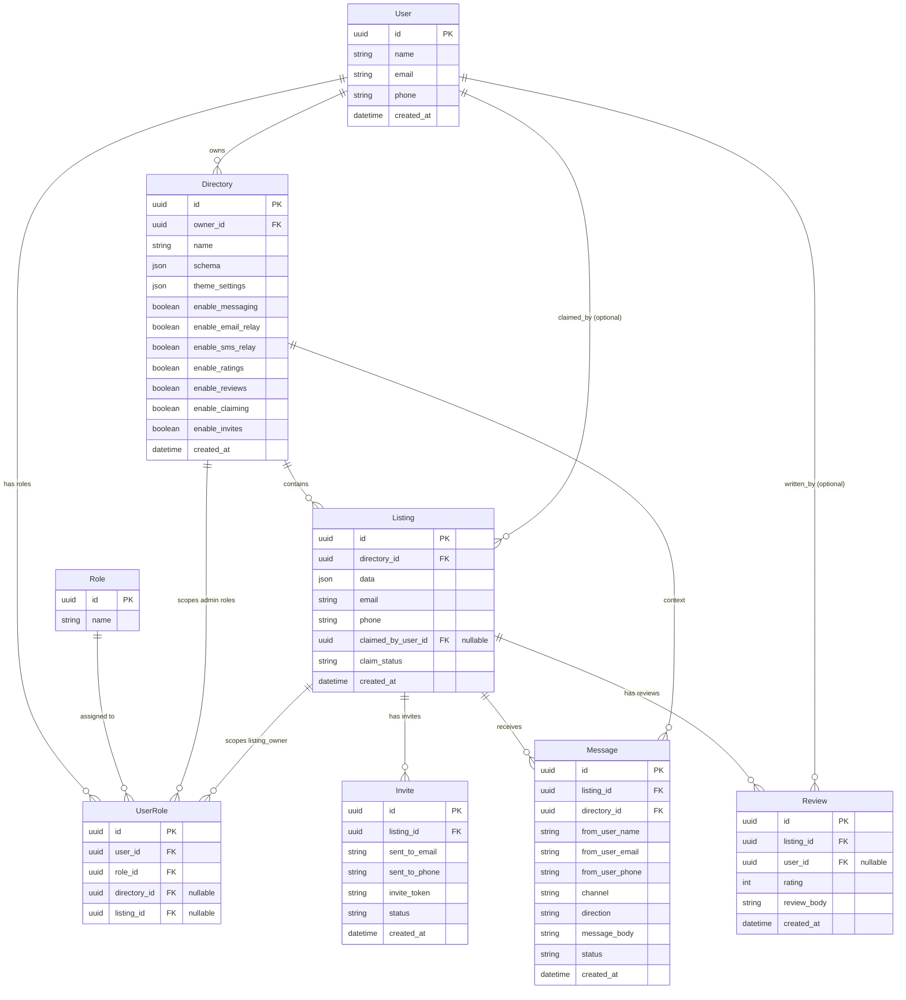

# 📘 Database Diagram (Mermaid ERD)

---

# 🧩 Explanation of the Diagram

## 1. **Users & Roles**

You have a flexible RBAC system:

- `platform_admin`
- `directory_admin` (scoped to a directory)
- `listing_owner` (scoped to a listing)

`UserRole` allows scoping roles to directories or listings without hardcoding logic.

---

## 2. **Directories**

Each directory has:

- its own schema
- its own theme
- its own feature flags
- its own owner

This makes each directory feel like its own product.

---

## 3. **Listings**

Listings belong to directories and store:

- schema‑driven data
- email/phone for messaging
- claim status
- optional `claimed_by_user_id`

---

## 4. **Invites**

Directory owners can invite businesses to claim listings.

Tracks:

- email/phone
- token
- status

---

## 5. **Messages**

Even in v1 (simple relay), messages are stored as **outbound events**.

This future‑proofs:

- masked email
- SMS proxy
- full inbox
- threading
- analytics

---

## 6. **Reviews**

Optional, controlled by directory feature flags.

---

# 🧭 Next Step Options

If you want, I can generate:

- A **Prisma schema**
- A **Postgres SQL schema**
- A **Next.js folder structure**
- A **full API design**
- A **claiming flow sequence diagram**
- A **messaging relay sequence diagram**

Just tell me which direction you want to go.